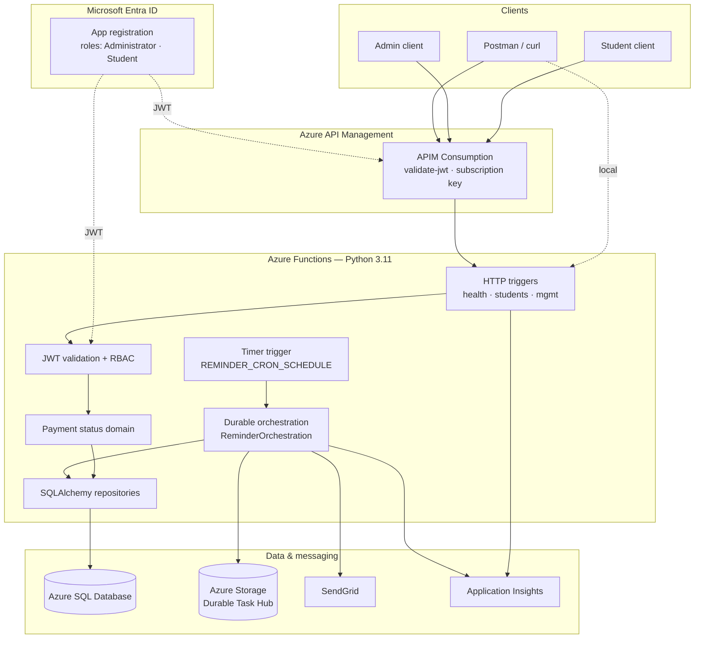
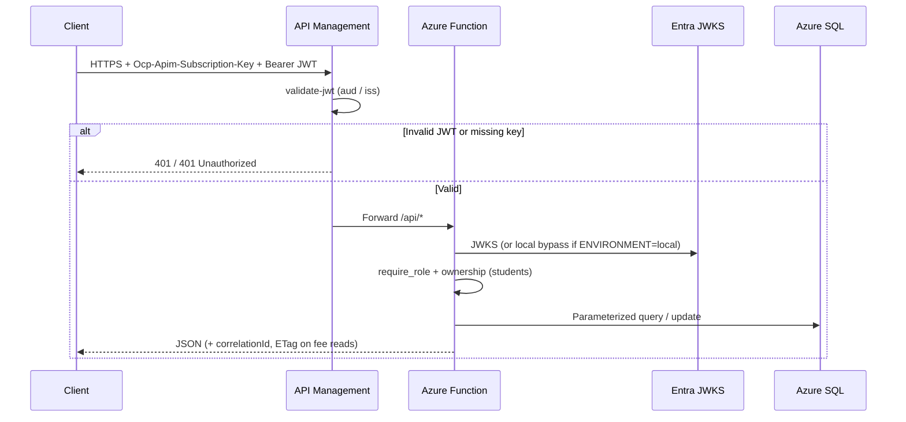
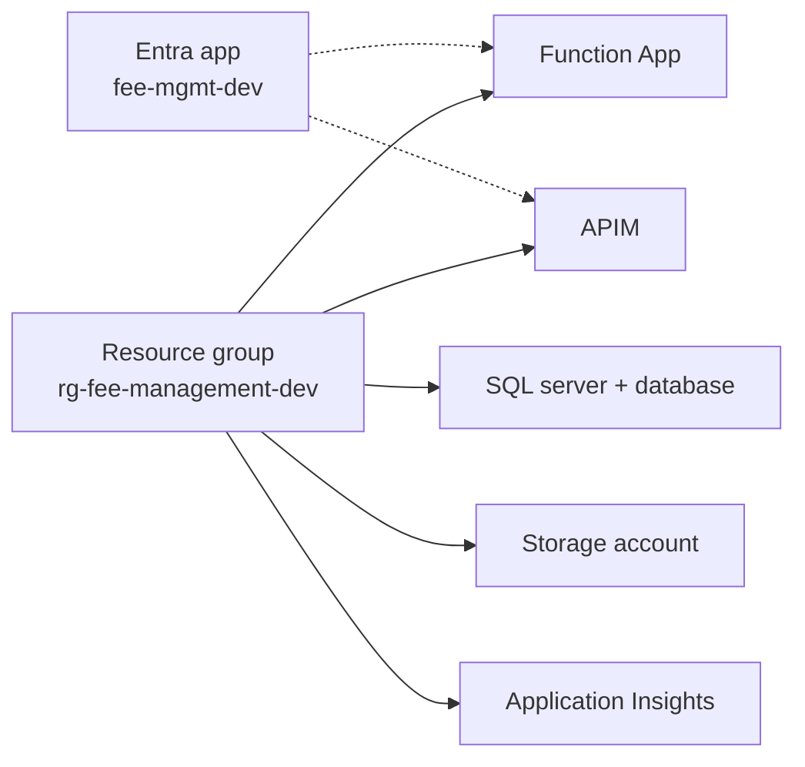
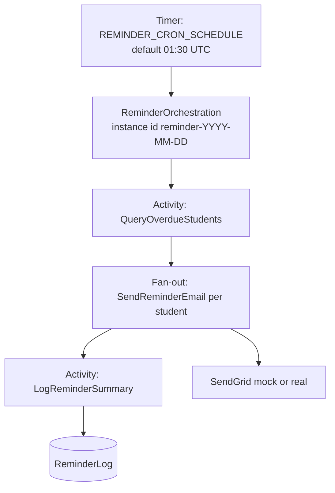

# Fee Management System

Cloud-native **Student Fee Management System** on Microsoft Azure: serverless APIs, relational fee data, Entra ID RBAC, automated overdue reminders, and API Management at the edge.

| | |
|---|---|
| **Stack** | Azure Functions (Python 3.11) · Azure SQL · Durable Functions · Entra ID · APIM · SendGrid · Application Insights |
| **Design** | [Technical Design Document](Docs/Fee_Management_System_TDD%20(1).md) |
| **API surface** | Student self-service · Admin fee management · Health · Daily reminder orchestration |

---

## Table of contents

1. [Overview](#overview)
2. [Solution architecture](#solution-architecture)
3. [Features](#features)
4. [Repository layout](#repository-layout)
5. [Prerequisites](#prerequisites)
6. [Local development](#local-development)
7. [Database setup](#database-setup)
8. [Azure deployment guide](#azure-deployment-guide)
9. [API reference](#api-reference)
10. [Authentication & RBAC](#authentication--rbac)
11. [Reminder workflow](#reminder-workflow)
12. [Observability & errors](#observability--errors)
13. [Testing](#testing)
14. [CI/CD](#cicd)
15. [Configuration reference](#configuration-reference)
16. [Implementation notes](#implementation-notes)

---

## Overview

Educational institutions often track fees in spreadsheets. This system provides:

- A single source of truth in **Azure SQL**
- Computed payment status: **Paid** · **PartiallyPaid** · **Overdue**
- Secure APIs for students (own record) and administrators (list / update)
- Daily **Durable Functions** orchestration that emails overdue students via SendGrid
- **Entra ID** JWT + app roles, fronted by **API Management** in Azure

Local development uses Azure SQL + Azure Storage directly (no Docker SQL / Azurite required) so the path matches cloud deployment.

---

## Solution architecture

### High-level components



### Request path (authenticated API)



### Payment status rules

| Condition | Status |
|---|---|
| `PaidAmount >= TotalFee` | `Paid` |
| `PaidAmount > 0` and `PaidAmount < TotalFee` and `DueDate >= today` | `PartiallyPaid` |
| `PaidAmount < TotalFee` and `DueDate < today` | `Overdue` |

Status is computed in the domain layer (`src/fee_management/domain/payment_status.py`) — never stored as a writable column for business truth.

### Azure resource topology (dev)



| Resource | Example (dev) |
|---|---|
| Resource group | `rg-fee-management-dev` (Central India) |
| Function App | `fee-management-func-samarth` |
| Function host | `https://fee-management-func-samarth-e3cfb3ctfxbng9dc.centralindia-01.azurewebsites.net` |
| APIM gateway | `https://apim-feemgmt-dev-samarth.azure-api.net` |
| APIM API | `/api/v1/*` → Function `/api/*` |
| Entra app | `fee-mgmt-dev` (`d49fca6c-f6c0-4dc0-8666-02f5b29ee099`) |
| SQL | `sqlfeemgmtdev2026` / `sqldb-feemgmt-dev` |

> Names above reflect the current student/dev deployment. Replace with your own when deploying a fork.

---

## Features

- **Student APIs** — fee details and payment status for the caller’s own record (OID match)
- **Admin APIs** — paginated/filterable student list; fee update with optimistic concurrency (`If-Match` / `rowVersion`)
- **Health** — unauthenticated liveness with DB connectivity check
- **Reminders** — timer + Durable fan-out email; mock or real SendGrid; `ReminderLog` audit rows
- **Security** — Entra JWT, app roles, APIM `validate-jwt` + subscription keys
- **Observability** — structured logs, `x-correlation-id` / `correlationId`, optional Application Insights
- **Errors** — centralized §16 taxonomy (400 / 401 / 403 / 404 / 409 / 503 / 500)

---

## Repository layout

```
fee-management-system/
├── function_app.py                 # Host entry (re-exports app)
├── host.json                       # Functions + Durable Task Hub
├── requirements.txt
├── pyproject.toml
├── src/fee_management/
│   ├── api/                        # HTTP blueprints (health, students, admin)
│   ├── auth/                       # JWT validation + RBAC
│   ├── data/                       # SQLAlchemy Core repositories
│   ├── domain/                     # Models, payment status, exceptions
│   ├── durable/                    # Timer, orchestrator, activities, HTTP start
│   ├── notifications/              # SendGrid client + templates
│   ├── telemetry/                  # Logging + correlation
│   ├── config.py
│   └── function_app.py             # DFApp wiring
├── sql/                            # Schema, seed, fixes, apply scripts
├── infra/                          # Bicep scaffolds + apim-policy.xml
├── local/local.settings.json.example
├── scripts/                        # Token / OID helpers (dev)
├── tests/
│   ├── unit/
│   ├── integration/                # Azure SQL (requires local.settings.json)
│   └── api/FeeManagement.postman_collection.json
├── Docs/                           # TDD
└── .github/workflows/              # CI (+ CD placeholder)
```

---

## Prerequisites

| Tool | Version / notes |
|---|---|
| Python | **3.11.x** |
| Azure Functions Core Tools | **v4.x** |
| Azure CLI | Latest (deploy / tokens) |
| ODBC Driver 18 for SQL Server | Required for `pyodbc` |
| Azure subscription | SQL, Storage, Functions, APIM, App Insights |
| SendGrid account | Optional locally (`SENDGRID_MODE=mock`) |

---

## Local development

### 1. Clone and create a virtualenv

```bash
git clone <your-repo-url>
cd fee-management-system

python -m venv .venv
# Windows
.venv\Scripts\activate
# Linux / macOS
source .venv/bin/activate

pip install -r requirements.txt
pip install -e .
```

### 2. Local Function settings

```bash
# Windows
copy local\local.settings.json.example local.settings.json
# Linux / macOS
cp local/local.settings.json.example local.settings.json
```

Edit `local.settings.json` (git-ignored):

- `SQL_CONNECTION_STRING` — Azure SQL (allow your client IP on the firewall)
- `AzureWebJobsStorage` — Azure Storage connection string (Functions + Durable)
- `AAD_TENANT_ID` / `AAD_AUDIENCE` — for real JWT testing; local bypass works with `ENVIRONMENT=local`
- Leave `SENDGRID_MODE=mock` unless you intend to send real mail

### 3. Apply the database (see [Database setup](#database-setup))

### 4. Start the host

```bash
func start
```

Base URL: `http://localhost:7071/api`

### 5. Smoke test

```bash
curl http://localhost:7071/api/health

curl -H "Authorization: Bearer local-admin-token" \
  http://localhost:7071/api/mgmt/students?page=1&pageSize=5
```

---

## Database setup

Scripts live under `sql/`. Core apply (schema + seed + indexes):

```bash
# Requires SQL_CONNECTION_STRING in the environment or local.settings.json loaded by the script
python sql/apply_azure_sql.py
```

Runs in order:

| Order | Script | Purpose |
|---|---|---|
| 1 | `001_create_schema.sql` | `Students`, `Administrators`, `ReminderLog` |
| 2 | `002_seed_sample_data.sql` | 20 students, 3 administrators |
| 3 | `003_indexes_constraints.sql` | Indexes + `UpdatedAt` trigger |

**Optional / environment-specific**

| Script | When |
|---|---|
| `004_local_dev_aad_oids.sql` | Link StudentID `4` to local student bypass OID (`python sql/apply_local_aad_oids.py`) |
| `005_fix_seed_due_dates.sql` | Correct not-yet-due seed dates |
| `006_drop_superadmin_role.sql` | Legacy DBs that still allow `SuperAdmin` (fresh `001` already Administrator-only) |
| `007_link_entra_dev_users.sql` | Map Entra object IDs + emails for Azure demo users |

---

## Azure deployment guide

Infrastructure Bicep under `infra/` is a **scaffold** (parameters/modules exist; production-ready IaC is incomplete). The working path below is the **manual / Portal + CLI** deployment used for the graded Azure environment.

### Step 1 — Resource group

```bash
az group create --name rg-fee-management-dev --location centralindia
```

### Step 2 — Storage account

Create a general-purpose v2 storage account in the resource group. Copy the connection string for `AzureWebJobsStorage` and Durable Functions.

### Step 3 — Azure SQL

1. Create a SQL server + database (e.g. `sqldb-feemgmt-dev`).
2. Set SQL auth (or configure Microsoft Entra auth for the Function identity).
3. Firewall: allow Azure services + your client IP for migrations.
4. Run `python sql/apply_azure_sql.py` against the database.
5. Apply `007_link_entra_dev_users.sql` (or equivalent) once Entra users exist.

### Step 4 — Application Insights

Create an Application Insights resource and copy the **connection string** into the Function App setting `APPLICATIONINSIGHTS_CONNECTION_STRING`.

### Step 5 — Function App

1. Create a **Python 3.11** Function App (Consumption or Premium) on Linux, linked to the storage account.
2. Deploy code from the repo root, for example:

```bash
func azure functionapp publish <FUNCTION_APP_NAME> --python
```

3. Configure application settings (at minimum):

| Setting | Notes |
|---|---|
| `AzureWebJobsStorage` | Storage connection string |
| `FUNCTIONS_WORKER_RUNTIME` | `python` |
| `PYTHONPATH` | `src` |
| `ENVIRONMENT` | `azure` (or anything other than `local` — disables auth bypass) |
| `SQL_CONNECTION_STRING` | ODBC Driver 18 connection string |
| `AAD_TENANT_ID` | Entra tenant ID |
| `AAD_AUDIENCE` | `api://<app-id>` and/or bare app GUID (comma-separated OK) |
| `SENDGRID_MODE` | `real` or `mock` |
| `SENDGRID_API_KEY` | Required when mode is `real` |
| `SENDGRID_FROM_EMAIL` | Verified sender |
| `APPLICATIONINSIGHTS_CONNECTION_STRING` | Optional but recommended |
| `REMINDER_CRON_SCHEDULE` | Default `0 30 1 * * *` (01:30 UTC / 07:00 IST) |
| `LOG_LEVEL` | `INFO` |

### Step 6 — Entra ID app registration

1. Register an application (e.g. `fee-mgmt-dev`).
2. Expose an API scope (e.g. `access_as_user`) with Application ID URI `api://<app-id>`.
3. Add **App roles**:
   - `Administrator` (allowed member types: Users/Groups)
   - `Student`
4. Assign users/groups to roles (Enterprise application → Users and groups).
5. Pre-authorize Azure CLI or your client app for the scope if you mint tokens with `az account get-access-token`.
6. Link `AadObjectId` on `Administrators` / `Students` rows to each user’s Entra **oid**.

### Step 7 — API Management

1. Create an **APIM Consumption** instance (or Developer/Standard if preferred).
2. Add an HTTP API that backends to the Function App (`/api/*`).
3. Public path convention used here: **`/api/v1/*` → Function `/api/*`**.
4. Apply the policy in [`infra/apim-policy.xml`](infra/apim-policy.xml):
   - `GET .../health` — no JWT (subscription key still required if product enforces it)
   - All other operations — `validate-jwt` against the tenant OpenID config; audiences = app GUID **and** `api://<app-id>`
5. Create products/subscriptions (e.g. student vs admin) and pass `Ocp-Apim-Subscription-Key` from clients.

> APIM **Consumption** does not support `rate-limit-by-key` the way some TDD samples describe; subscription keys + JWT validation are the enforced edge controls.

### Step 8 — SendGrid

1. Create an API key and verify the from-address.
2. Set `SENDGRID_MODE=real`, `SENDGRID_API_KEY`, `SENDGRID_FROM_EMAIL` on the Function App.
3. Smoke-test:

```bash
# Function key required in Azure (AuthLevel.FUNCTION)
curl -X POST \
  "https://<FUNCTION_HOST>/api/reminders/run?code=<FUNCTION_KEY>&force=true"
```

### Step 9 — Verify

```bash
# Health via APIM (subscription key)
curl -H "Ocp-Apim-Subscription-Key: $APIM_KEY" \
  https://<APIM_GATEWAY>/api/v1/health

# Admin token (after az login to the tenant)
az account get-access-token \
  --resource api://<APP_ID> \
  --tenant <TENANT_ID> \
  --query accessToken -o tsv

# Admin list via APIM
curl -H "Ocp-Apim-Subscription-Key: $APIM_KEY" \
  -H "Authorization: Bearer $TOKEN" \
  "https://<APIM_GATEWAY>/api/v1/mgmt/students?page=1&pageSize=5"
```

Decode the JWT at [jwt.ms](https://jwt.ms) and confirm `roles` and `aud` before debugging 401 vs 403.

---

## API reference

Function routes use the `/api` prefix. Through APIM, replace `/api` with `/api/v1` (same relative paths).

| Method | Path | Auth | Description |
|---|---|---|---|
| `GET` | `/api/health` | None (APIM: key only) | Liveness + DB check |
| `GET` | `/api/students/{studentId}` | Student (own) or Administrator | Fee details + status + `rowVersion` |
| `GET` | `/api/students/{studentId}/payment-status` | Student (own) or Administrator | Status only |
| `GET` | `/api/mgmt/students` | Administrator | Paginated list; filters: `course`, `status`, `page`, `pageSize` |
| `PUT` | `/api/mgmt/students/{studentId}/fee` | Administrator | Update fees; send `If-Match: <rowVersion>` |
| `POST` | `/api/reminders/run` | Function key (Azure) | Start reminder orchestration; `?force=true` for a fresh instance id |

**Why `/mgmt` instead of `/admin`?** The Azure Functions host reserves `/admin/*`. APIM can expose a friendlier public path later if required by the TDD.

### Optimistic concurrency

1. `GET /api/students/{id}` → read `rowVersion` (also returned as `ETag`).
2. `PUT /api/mgmt/students/{id}/fee` with header `If-Match: <rowVersion>`.
3. On conflict → **`409 CONCURRENCY_CONFLICT`** — re-fetch; do not blind-retry with the old token.

### Example fee update body

```json
{
  "totalFee": 80000,
  "paidAmount": 40000,
  "dueDate": "2026-02-01"
}
```

---

## Authentication & RBAC

### Roles

| App role | Capabilities |
|---|---|
| `Administrator` | All student reads; list; fee updates |
| `Student` | Own student record only (OID must match `Students.AadObjectId`) |

`require_role` allows access if the JWT contains **any** of the permitted roles. A user with **both** roles can call admin APIs (so a Student-denied demo needs a **Student-only** token).

### Local bypass (`ENVIRONMENT=local` only)

| Token | Role | Notes |
|---|---|---|
| `local-admin-token` | Administrator | Full access |
| `local-student-token` | Student | Own record — StudentID **4** after `004_local_dev_aad_oids.sql` |

Header: `Authorization: Bearer <token>`. Bypass is **ignored** in Azure when `ENVIRONMENT` is not `local`.

### Azure tokens

```bash
az account get-access-token \
  --resource api://d49fca6c-f6c0-4dc0-8666-02f5b29ee099 \
  --tenant <TENANT_ID> \
  --query accessToken -o tsv
```

Tokens may present `aud` as either `api://<app-id>` or the bare app GUID — both APIM and the Function validator accept both.

### Example role mapping (dev)

| Identity | App role | Linked DB row |
|---|---|---|
| Admin user | Administrator | `Administrators.AdminID = 1` |
| Student guest A | Student | `Students.StudentID = 4` |
| Student guest B | Student | `Students.StudentID = 5` |

See `sql/007_link_entra_dev_users.sql`. Guest users must **accept** the Entra invite before their JWT contains usable claims.

---

## Reminder workflow



- Instance id is day-scoped; use `POST /api/reminders/run?force=true` to start a distinct instance (local re-runs / demos).
- Real SendGrid failures are isolated per activity (`Failed` status); transient retries follow the design (3 attempts, 5s / 10s backoff).
- Manual start in Azure requires the **function key** (`AuthLevel.FUNCTION`).

---

## Observability & errors

- Every HTTP request binds `x-correlation-id` (inbound or generated) and echoes `correlationId` on responses / error bodies.
- Durable runs use the orchestration `instance_id` as the correlation context across activities.
- Set `APPLICATIONINSIGHTS_CONNECTION_STRING` to export telemetry; leave empty for console-only logs locally.

| Exception / condition | HTTP |
|---|---|
| Validation errors | 400 |
| Missing / invalid token | 401 |
| Role / ownership failure | 403 |
| Not found (admin) | 404 |
| Stale `If-Match` | 409 |
| Fee constraint / integrity | 400 |
| DB operational (after retries) | 503 |
| Unexpected | 500 (generic message) |

---

## Testing

### Unit tests (CI)

```bash
pytest tests/unit -q
```

Covers payment status, RBAC, schemas, exception mapping, observability, and reminder workflow (mocked).

### Integration tests (Azure SQL)

Requires a valid `local.settings.json` with SQL connectivity:

```bash
pytest tests/integration -q
```

### Postman

Import [`tests/api/FeeManagement.postman_collection.json`](tests/api/FeeManagement.postman_collection.json).

| Variable | Local | Azure (APIM) |
|---|---|---|
| `baseUrl` | `http://localhost:7071/api` | `https://<APIM>/api/v1` |
| `adminToken` | `local-admin-token` | Entra JWT with `Administrator` |
| `studentToken` | `local-student-token` | Entra JWT with `Student` only (for 403 demos) |
| `apimKey` | _(n/a)_ | APIM subscription key |

---

## CI/CD

| Workflow | Path | Behavior |
|---|---|---|
| **CI** | [`.github/workflows/ci.yml`](.github/workflows/ci.yml) | On push/PR to `main`/`master`: Ruff, Black (`--line-length 100`), `pytest tests/unit` |
| **CD** | [`.github/workflows/cd.yml`](.github/workflows/cd.yml) | Placeholder (disabled) — deploy via `func azure functionapp publish` or enable CD when secrets are configured |

---

## Configuration reference

Primary template: [`local/local.settings.json.example`](local/local.settings.json.example).

| Variable | Purpose |
|---|---|
| `AzureWebJobsStorage` | Functions runtime + Durable storage |
| `FUNCTIONS_WORKER_RUNTIME` | `python` |
| `PYTHONPATH` | `src` |
| `ENVIRONMENT` | `local` enables auth bypass |
| `SQL_CONNECTION_STRING` | ODBC Driver 18 connection string |
| `SQL_SERVER_HOST` / `SQL_DATABASE_NAME` / `SQL_AUTH_MODE` | Supporting SQL settings |
| `AAD_TENANT_ID` | Entra tenant |
| `AAD_AUDIENCE` | Expected JWT audience(s), comma-separated |
| `LOCAL_AUTH_BYPASS_*` | Local-only tokens / student OID |
| `SENDGRID_MODE` | `mock` \| `real` |
| `SENDGRID_API_KEY` / `SENDGRID_FROM_EMAIL` | Real email |
| `APPLICATIONINSIGHTS_CONNECTION_STRING` | Optional App Insights |
| `REMINDER_CRON_SCHEDULE` | NCRONTAB; default `0 30 1 * * *` |
| `LOG_LEVEL` | `INFO` default |

**Never commit** `local.settings.json`, Function keys, APIM subscription keys, or SendGrid keys.

---

## Implementation notes

- Local and cloud both target **Azure SQL** and **Azure Storage** (no Docker SQL / Azurite required for the documented path).
- Integration tests use Azure SQL via `local.settings.json` (not testcontainers).
- Admin HTTP paths are `/api/mgmt/...` because Functions reserves `admin`.
- Dual JWT audiences (URI + app GUID) are supported in APIM policy and `jwt_validator.py`.
- Roles are limited to **Administrator** and **Student** (`sql/006_drop_superadmin_role.sql` for older DBs).
- Seed due-date corrections: `sql/005_fix_seed_due_dates.sql`.
- Durable hub name: `FeeManagementTaskHub` (`host.json`).
- Design detail and assignment rationale: [TDD](Docs/Fee_Management_System_TDD%20(1).md). Where code and TDD diverge (e.g. `/mgmt` vs `/admin`, local Azure SQL vs Docker), **this README and the repository reflect the implemented system**.

---

## License

This project is submitted as academic / assignment coursework. Add a license file if you intend to redistribute.
